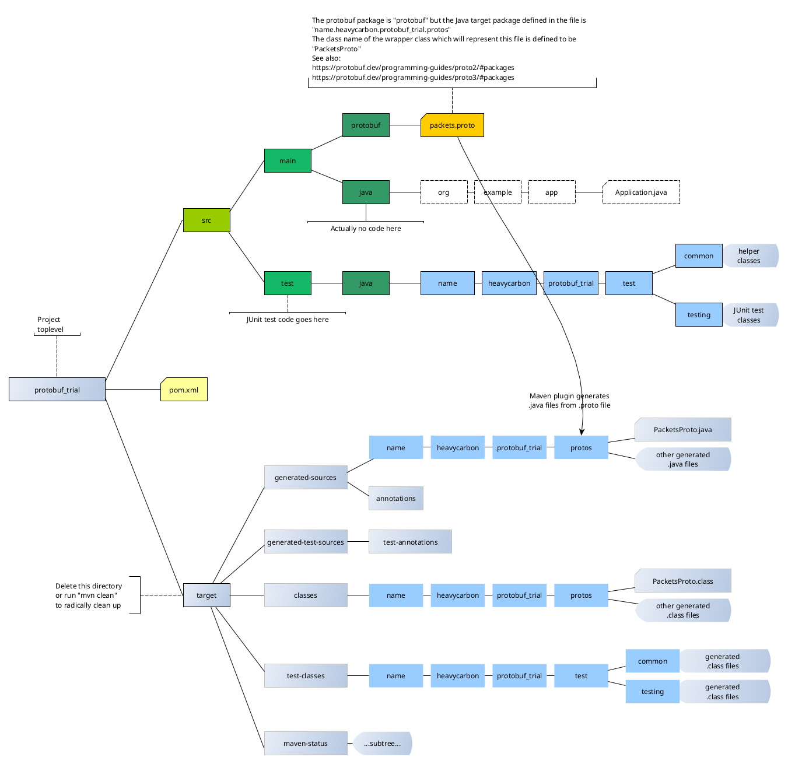

# A simple exercise in Google Protocol Buffers.

Here, we want to define serialization for "packets" exchanged between a client and a server, whereby the client
wants to log in to the server. I tried to write this by hand, which is feasible but annoying and probably will be
beset by "that one case one didn't think about", so why not use [Google protocol buffers](https://protobuf.dev/) ("protobufs") to
perform all of the serialization/deserialization (to a compact binary representation, which is nice).

Actually "going out to the network" is not performed in this project. This is only about testing serialization
and deserialization of data packets. And getting everything to work in Intellij IDEA.

- This is a standard Maven project, take a look at the [POM](pom.xml)
- There is a single `.proto` definition file (for now) from which protobuf source is generated: [packets.proto](src/main/protobuf/packets.proto)

Relevant links to documentation:

- [Google protobufs on GitHub](https://github.com/protocolbuffers/protobuf)
- [Google protobufs documentation](https://protobuf.dev/)
   - [Getting started](https://protobuf.dev/getting-started/)
- [Setting the project up in Intellij IDEA: "How to Work With Protobuf-Maven Projects in IntelliJ IDEA"](https://blog.jetbrains.com/idea/2023/05/how-to-work-with-protobuf-maven-projects-in-intellij-idea/)
- [The protobuf Maven artifact at Maven Repository](https://mvnrepository.com/artifact/com.google.protobuf/protobuf-java)

An interesting problem is that jsut "compiling" the project in IntellijIDEA via the corresponding menu entry does
not generate compilable Google protobuf source code. One has to execute "Run Maven > compile" through the dropdown menu for example.

The file tree of the project looks as follows:

Finding a proper "POM" is somewhat black magic, but in the end it worked out. Pointed questions to AI 🦜 helped a lot!

The depencies pulled in via Maven are as follows (this image can be obtained in IntelliJ IDEA under `View > Tool Windows > Maven`:

